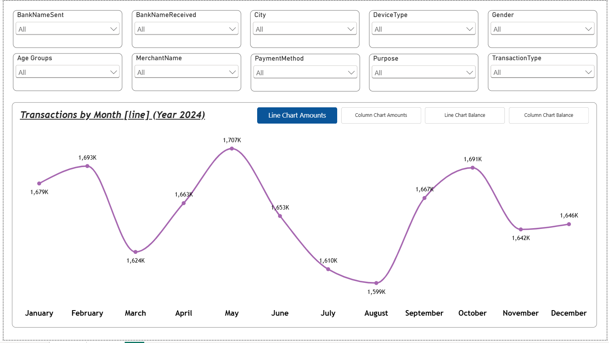
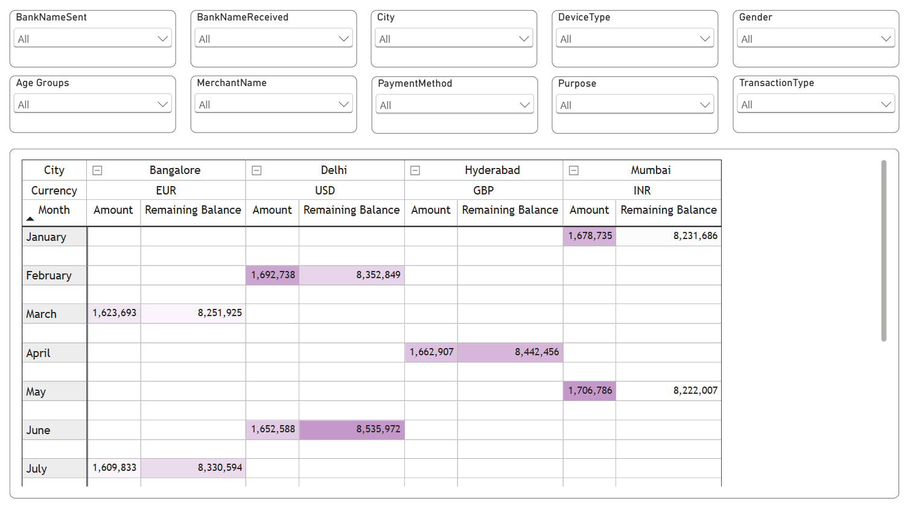

[README.md](https://github.com/user-attachments/files/32553250/README.md)
# UPI Transactions Data Analysis – Power BI

An interactive **UPI Transactions Data Analysis Dashboard** built using **Microsoft Power BI** to analyze transaction amounts and remaining balances across months, cities, currencies, and transaction-related categories.

## 📊 Dashboard Preview

### Page 1 – Monthly Transaction & Balance Analysis

The first page provides monthly analysis of **Transaction Amount** and **Remaining Balance** for 2024. It includes interactive slicers and bookmark-based navigation.



### Page 2 – City, Currency & Monthly Analysis

The second page uses a **Matrix visual** to analyze City, Currency, Month, Transaction Amount, and Remaining Balance.



## 🎯 Project Objectives

- Analyze UPI transaction amounts by month.
- Analyze remaining balance by month.
- Compare transaction values across different cities.
- Analyze transactions according to currency.
- Provide interactive filtering using slicers.
- Synchronize slicers between dashboard pages.
- Provide multiple visual views using Power BI bookmarks.
- Present City–Currency–Month analysis using a Matrix visual.

## 🛠️ Tools & Technologies

- Microsoft Power BI
- Microsoft Excel
- Power Query / Data Transformation
- Power BI Slicers
- Power BI Sync Slicers
- Power BI Bookmarks
- Line Chart
- Column Chart
- Matrix Visual

## 📁 Dataset

The project uses an Excel dataset containing **20,000 UPI transaction records** covering 2024.

The dataset includes fields such as:

- Transaction Date
- Transaction Time
- Transaction Amount
- Remaining Balance
- Bank Name Sent
- Bank Name Received
- City
- Gender
- Transaction Type
- Transaction Status
- Device Type
- Payment Method
- Merchant Name
- Purpose
- Customer Age
- Payment Mode
- Currency
- Customer Account Number
- Merchant Account Number

## 🔄 Data Preparation & Project Workflow

1. Load the UPI transaction dataset into Power BI.
2. Analyze and prepare the data according to dashboard requirements.
3. Add interactive slicers.
4. Synchronize slicers across both dashboard pages.
5. Create monthly transaction and balance visuals.
6. Add bookmarks for switching between visual views.
7. Create a Matrix visual for City, Currency, Month, Amount and Remaining Balance analysis.

## 📄 Page 1 – Transactions & Balance Analysis

### Interactive Slicers

- BankNameSent
- BankNameReceived
- City
- DeviceType
- Gender
- Age Groups
- MerchantName
- PaymentMethod
- Purpose
- TransactionType

### Bookmark Navigation

Four bookmark options are available:

1. **Line Chart Amounts**
2. **Column Chart Amounts**
3. **Line Chart Balance**
4. **Column Chart Balance**

These bookmarks allow the user to switch between different chart views.

## 📄 Page 2 – City, Currency & Monthly Analysis

The second page uses a Matrix visual with the hierarchy:

**City → Currency → Month**

The matrix displays:

- Amount
- Remaining Balance

This provides detailed analysis at city, currency and monthly levels.

## 🔗 Slicer Synchronization

The slicers on both dashboard pages are synchronized using **Power BI Sync Slicers**.

When a slicer is changed on one page, the corresponding filter is applied to the other page as well.

## 📌 Key Power BI Features

### Slicers
Used for interactive filtering by bank, city, device, gender, age group, merchant, payment method, purpose and transaction type.

### Sync Slicers
Used to keep filters consistent across both dashboard pages.

### Bookmarks
Used to switch between Amount and Balance line/column chart views.

### Matrix Visual
Used for **City → Currency → Month** analysis with Amount and Remaining Balance.

## 📂 Project Structure

```text
UPI-Transactions-PowerBI/
│
├── README.md
├── images/
│   ├── page1.png
│   └── page2.png
├── UPI Transactions Data Analysis Power Bi project.pbix
└── UPI+Transactions.xlsx
```

## 🚀 How to Use

1. Download or clone this repository.
2. Open the `.pbix` file using Microsoft Power BI Desktop.
3. Use the slicers to filter the transaction data.
4. Use the bookmark buttons on Page 1 to switch chart views.
5. Navigate to Page 2 for City–Currency–Month analysis.
6. Expand the Matrix hierarchy to explore detailed values.

## 📈 Dashboard Highlights

- Interactive monthly transaction analysis
- Remaining balance analysis
- Multiple interactive slicers
- Slicer synchronization across pages
- Bookmark-based visual switching
- City-wise analysis
- Currency-wise analysis
- Monthly analysis
- Matrix-based detailed analysis

## 👨‍💻 Author

**Jay Prakash Patel**

B.Tech – Computer Science & Engineering (AI/ML)

## 📌 Project Summary

This project demonstrates the use of Power BI to transform UPI transaction data into an interactive analytical dashboard. It combines slicers, synchronized filters, bookmarks, charts and matrix-based analysis to explore transaction amounts and remaining balances across months, cities and currencies.
